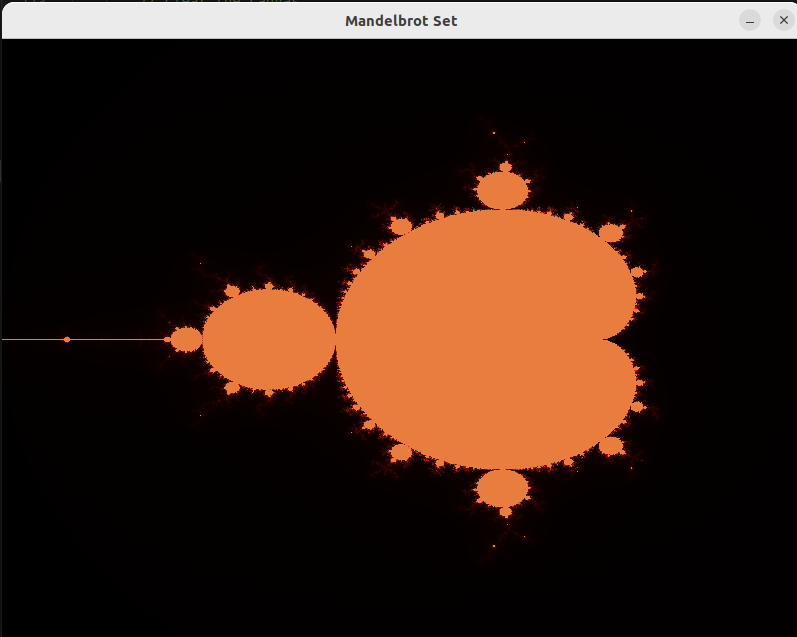

# Mandelbrot Set Plotter

## Install Requirements

Install the  requirements for the SDL-2 crate.

```
sudo apt-get install libsdl2-dev
```

## Display Mandelbrot Set

Start the window application that draws the Mandelbrot set.

```
cargo run
```

Use the following key for navigation

- `W`: Move up
- `S`: Move down
- `A`: Move left
- `D`: Move right  
- `E`: Zoom in
- `Q`: Zoom out

The window looks like the following picture.


